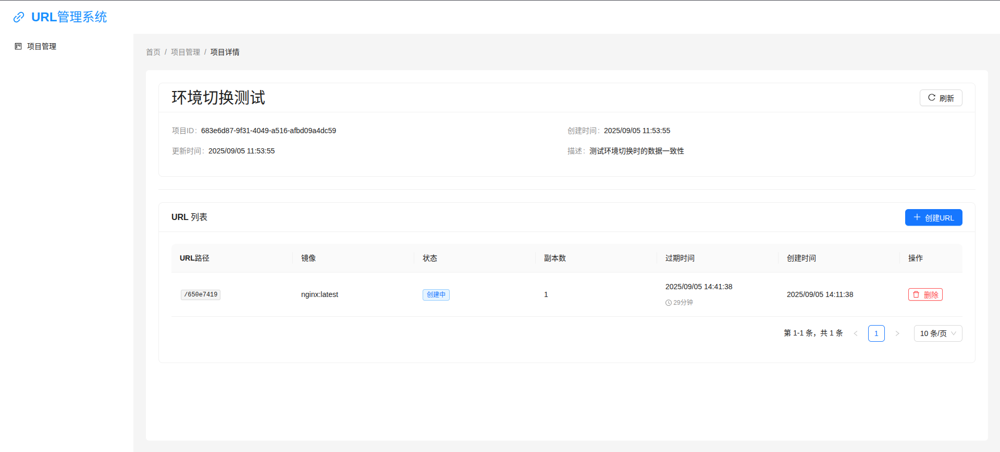

# URL Manager System

一个基于Kubernetes的URL管理系统，支持项目管理、动态URL路由和资源生命周期管理。

## 预览



## 功能特性

- **项目管理**: 支持创建和管理项目，逻辑分组不同业务的URL
- **动态URL**: 为每个项目生成随机URL路径，支持自定义过期时间
- **Kubernetes集成**: 自动创建和管理Pod、Service、Ingress资源
- **环境变量配置**: 支持为每个URL配置环境变量
- **生命周期管理**: 自动清理过期资源
- **Web界面**: 基于React + Ant Design的管理界面，支持响应式布局和菜单折叠
- **用户体验**: 支持菜单栏折叠/展开，小屏幕自动适应

## 技术栈

### 后端
- **语言**: Go 1.21+
- **框架**: Gin
- **数据库**: PostgreSQL
- **缓存**: Redis (用于分布式锁)
- **Kubernetes**: client-go

### 前端
- **框架**: React 18+ with TypeScript
- **UI库**: Ant Design
- **构建工具**: Vite

### 部署
- **容器化**: Docker
- **编排**: Kubernetes
- **包管理**: Helm Chart

## 项目结构

```
url-manager-system/
├── backend/           # Go后端服务
├── frontend/          # React前端应用
├── deployments/       # Helm Charts和部署配置
├── docs/             # 文档
├── images/           # 项目图片和截图
└── README.md
```

## 快速开始

### 环境要求

- Go 1.21+
- Node.js 18+
- PostgreSQL 14+
- Redis 6+
- Kubernetes 1.24+
- Docker

### 开发环境设置

1. 克隆项目
```bash
git clone <repository-url>
cd url-manager-system
```

2. 启动后端服务
```bash
cd backend
go mod tidy
go run main.go
```

3. 启动前端服务
```bash
cd frontend
npm install
npm run dev
```

## 架构说明

### 数据流
1. 用户在Web界面创建项目和URL
2. 后端验证请求并生成随机路径
3. 创建对应的Kubernetes资源(Deployment, Service, Ingress)
4. 定期检查过期资源并自动清理

### 安全特性
- 镜像白名单验证
- 资源限制和配额
- PodSecurity策略
- 环境变量加密存储

## API文档

详细的API文档请参考: [API Documentation](docs/api.md)

## 部署指南

详细的部署指南请参考: [Deployment Guide](docs/deployment.md)

## 贡献指南

欢迎提交Issue和Pull Request！

## 许可证

MIT License